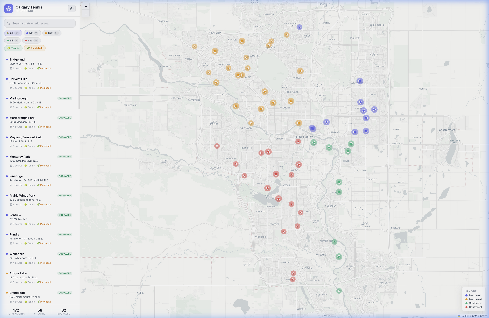

# 🎾 Calgary Tennis Court Finder

An interactive map of all public tennis and pickleball courts in Calgary, Alberta. Find courts near you, filter by type and region, get directions, and book online — all in one place.

**[🌐 Live Demo →](https://axe-me.github.io/calgary-tennis/)**



## Features

- **Interactive Map** — All 58 court locations plotted on a Leaflet map, color-coded by region (NE, NW, SE, SW)
- **Search** — Find courts by name or address
- **Region Filter** — Narrow results to a specific quadrant of the city
- **Type Filter** — Toggle between 🎾 Tennis and 🥒 Pickleball courts
- **Court Details** — Click any marker to see court count, sport types, and booking availability
- **Directions** — One-tap directions via Google Maps (desktop) or native map picker (mobile)
- **Online Booking** — Direct links to the City of Calgary's booking portal for each region
- **Dark / Light Mode** — Theme toggle with localStorage persistence
- **Responsive** — Works on desktop and mobile

## Data Source

Court information is sourced from the [City of Calgary Tennis Courts](https://www.calgary.ca/bookings/tennis-courts.html) page, including addresses, court counts, sport types, and booking availability.

## Tech Stack

| Layer     | Technology                |
|-----------|---------------------------|
| Framework | Vue 3 (Composition API)   |
| Build     | Vite                      |
| Map       | Leaflet + vue-leaflet     |
| Tiles     | CartoDB (dark & light)    |
| Hosting   | GitHub Pages              |
| CI/CD     | GitHub Actions            |

## Getting Started

```bash
# Clone
git clone https://github.com/axe-me/calgary-tennis.git
cd calgary-tennis

# Install
npm install

# Dev server
npm run dev
```

Open [http://localhost:5175](http://localhost:5175) to view the app.

## Build & Deploy

The app automatically deploys to GitHub Pages on every push to `main` via the included GitHub Actions workflow.

To build manually:

```bash
npm run build    # outputs to dist/
npm run preview  # preview the production build locally
```

## License

MIT
